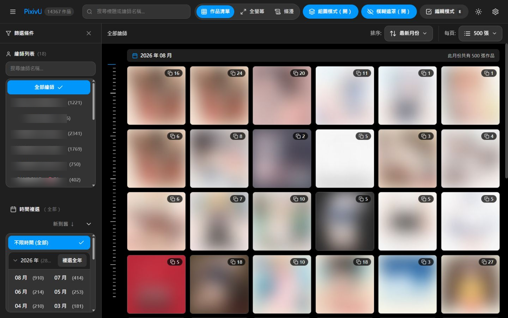
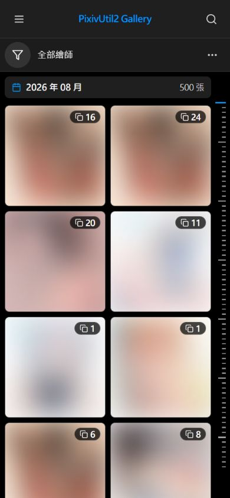
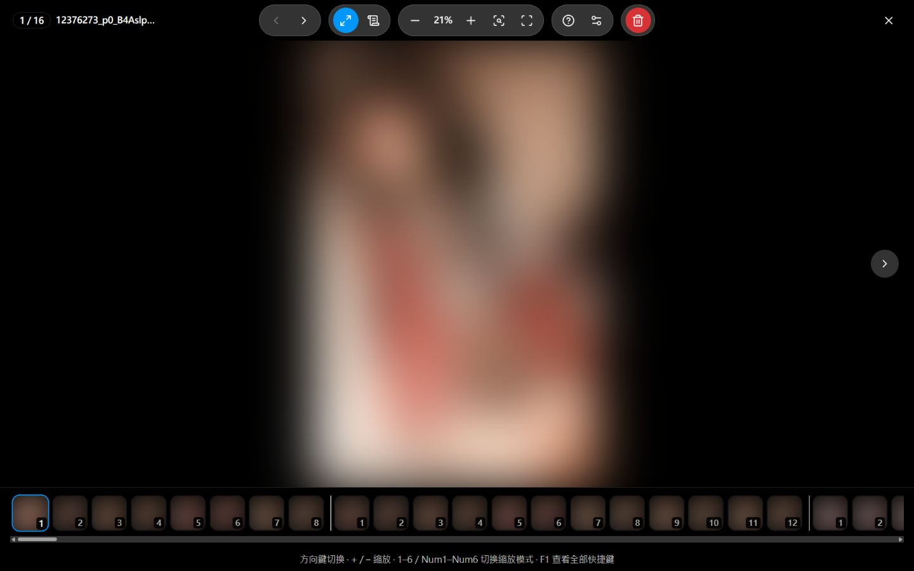
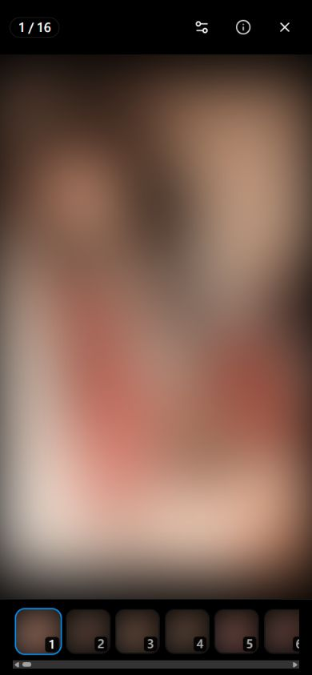
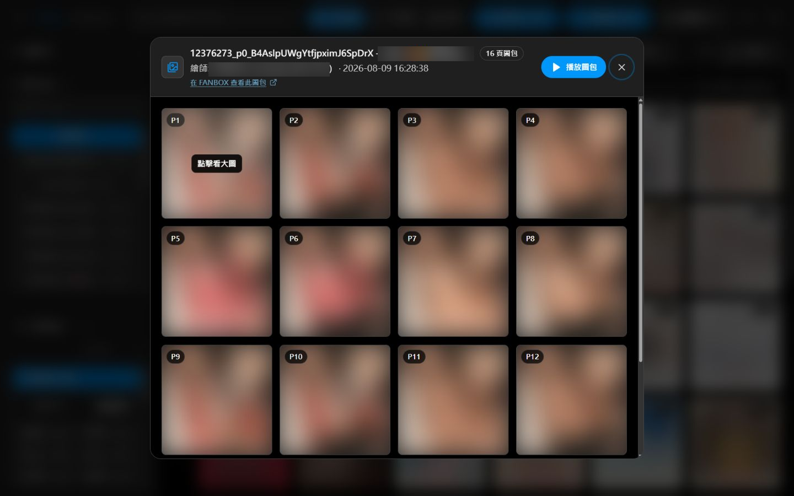

<p align="center">
  <a href="https://github.com/sugarbobo-ch/PixivUtil2-Web-Viewer/actions/workflows/ci-cd.yml"></a>
</p>

<p align="center">
  <a href="README.md">English</a> · <a href="README.zh-TW.md">繁體中文</a> · <a href="README.zh-CN.md">简体中文</a> · <strong>日本語</strong>
</p>

<h1 align="center">PixivUtil2 Web Viewer</h1>

PixivUtil2 Web Viewer は、ダウンロードした画像・動画・漫画を整理し、すばやく閲覧するための Windows 向けローカルライブラリです。メディアは自分のパソコンに置いたまま使え、外部サービスへアップロードする必要はありません。

## このプロジェクトを使う理由

ダウンロードした作品が増えると、フォルダーを一つずつ開くのは大変です。漫画のページがばらばらになり、特定の月に保存した作品を探すだけでも時間がかかります。この Viewer は、それらのフォルダーを検索しやすい一つのギャラリーにまとめ、画像や漫画に適した閲覧モードを提供します。

- PixivUtil2 のライブラリだけでなく、対応する一般のメディアフォルダーにも使えます。
- クラウドサービスの導入や、個人のメディアのアップロードは不要です。
- Windows 用のセットアップファイルから起動でき、プログラミングの知識は必要ありません。

## 主な機能

- ダウンロードした画像・動画・複数ページの漫画を、一つのギャラリーで整理してすばやく閲覧できます。
- 画像を全画面で集中して読めるほか、縦に長い漫画は Webtoon モードで続けて読めます。
- 1 枚ずつ見る単ページ表示と、本の見開きのように読む 2 ページ表示に対応しています。読む方向も左から右、右から左のどちらかを選べます。
- 時間軸をドラッグするか年月を選ぶだけで、ギャラリー全体を延々とスクロールせず、目的の月へ直接移動できます。
- 大きなライブラリでも軽快に動くよう、まず軽いサムネイルを表示し、画面の近くにある画像だけを読み込みます。別の月へ移動するときは、到着する前に周辺のサムネイルを準備します。
- 作者や日付による絞り込み、タイトル検索、並び替えに対応し、関連する漫画ページを一つの作品としてまとめます。
- 動画は全画面または Webtoon モードで再生でき、クリック、ダブルクリックによるシーク、長押しによる一時的な倍速再生に対応しています。
- ぼかし表示を使うと、タイトル、ページ数、操作ボタンを保ったまま、見せたくない画像を隠せます。
- PixivUtil2 の元データベースを書き換えず、Viewer 用の索引をバックグラウンドで更新します。
- 繁体字中国語、簡体字中国語、英語、日本語を、再起動せずに切り替えられます。

## PixivUtil2 とフォルダーのみでの利用

Pixiv の作品をダウンロードし、ローカルの情報を管理するには [PixivUtil2](https://github.com/Nandaka/PixivUtil2) の利用をおすすめします。この Viewer は、PixivUtil2 が作成したライブラリと、同じフォルダー構成で保存されたファイルを読み込めます。

手元のファイルを見るだけなら PixivUtil2 は必須ではありません。設定したフォルダーから対応メディアを直接探し、Viewer 専用の索引を作成できます。PixivUtil2 のインストールや `db.sqlite` の用意は不要です。

フォルダーだけで使う場合は、初回設定で **ローカルフォルダーを参照** を選ぶか、あとから **設定 → メディアデータベース** でフォルダーを指定します。選択した場所は Git の管理対象外である `web_config.json` に保存され、`config.ini` は必要ありません。

PixivUtil2 と一緒に使う場合は、その `config.ini` を選択します。Viewer は `[Settings] rootDirectory` だけをメディアの保存先として使用し、同じ場所に `db.sqlite` があれば Pixiv の作品情報を取り込みます。どちらのファイルも読み取り専用で扱います。

一度に使用できるデータ元は一つです。データ元やフォルダーを変更した場合は、設定を保存して画像データベースを更新すると、新しい内容がギャラリーに反映されます。

## 並び順とページ順

並び替えメニューでは、画像の日時と作品内のページ順を分けて扱います。**新しい作品を先頭にし、ページは昇順** を選ぶと、新しい作品を上に表示しながら、各作品の中では `p1 → p2 → p3`、`1-1 → 1-2 → 1-10`、`a → b → c` のように自然な順番を保ちます。Pixiv のファイル名では作品 ID と `_pN` を利用し、それ以外の対応ライブラリではファイル名とフォルダー構成から順番を判断します。

## 画面例

以下の例では組み込みのぼかし表示を使用しています。メディアはローカルに置かれたままで、リポジトリに含まれるのは、ぼかし済みのスクリーンショットだけです。

<table>
  <tr>
    <th>デスクトップのグリッド</th>
    <th>モバイルのグリッド</th>
  </tr>
  <tr>
    <td></td>
    <td></td>
  </tr>
  <tr>
    <th>デスクトップの全画面表示</th>
    <th>モバイルの全画面表示</th>
  </tr>
  <tr>
    <td></td>
    <td></td>
  </tr>
  <tr>
    <th>デスクトップの漫画パック</th>
    <th>モバイルの Webtoon</th>
  </tr>
  <tr>
    <td></td>
    <td></td>
  </tr>
</table>

## Windows でのかんたんセットアップ

Node.js や Python を自分でインストールする必要はなく、システムの `PATH` も変更しません。

1. **`install.bat`** をダブルクリックします。
2. セットアップが終わったら **`run_viewer.bat`** をダブルクリックします。
3. ブラウザーが自動で開かない場合は <http://localhost:3000> を開きます。

インストーラーは、このプロジェクト専用の実行環境を `.runtime/` にダウンロードします。

- ポータブル版 Node.js と pnpm
- uv と、uv が管理する Python
- `.runtime/backend-venv/` に保存されるバックエンドの依存関係
- `.runtime/pnpm-store/` に保存される pnpm の共有データ
- `frontend/node_modules/` に保存されるフロントエンドの依存関係

管理者権限は必要ありません。初回インストール時のみインターネット接続が必要です。

## 基本的な使い方

1. `install.bat` を実行し、`run_viewer.bat` で Viewer を起動します。
2. データ元を選びます。
   - PixivUtil2 のライブラリを使う場合は `config.ini` を選びます。Viewer が使うのは、そのファイルの `rootDirectory` と、同じ場所にある任意の `db.sqlite` だけです。
   - フォルダーだけを見る場合は、メディアフォルダーを直接選びます。PixivUtil2、`config.ini`、`db.sqlite` は不要です。
3. **設定 → メディアデータベース** を開き、**画像データベースを更新** を選びます。バックグラウンド処理が Viewer の索引を更新し、必要に応じて画像の色も解析します。
4. 作者や月で絞り込み、漫画パックを全画面または Webtoon モードで開きます。画面共有やスクリーンショットの前には **ぼかし** を有効にできます。
5. サムネイルのキャッシュが増えたら、**設定 → メディアデータベース → サムネイルを整理** を使用します。整理したファイルは復元できる場所へ移動します。

## 全画面動画プレーヤーの操作

動画を全画面で表示しているときは、次の操作が使えます。

- `Space` を押すか、標準の操作バー以外の動画部分をクリックして、再生と一時停止を切り替えます。
- 左半分をダブルクリックすると巻き戻し、右半分では早送りします。移動時間は設定でき、初期値は 5 秒です。
- 動画の左右どちらかを長押しすると、一時的に倍速再生します。初期値は 2 倍速で、指やボタンを離すと元の速度に戻ります。
- 動画の外側にあるステージの左または右をクリックすると、前または次の作品へ移動します。動画内をクリックしても全画面表示は閉じません。
- 動画標準の操作バーと進行位置を使って、好きな場所へ移動できます。操作部は動画の表示範囲にそろえて配置されます。
- `F1` を押すと、動画のジェスチャーを含む全画面ショートカットの説明が開きます。
- シーク時間と長押し時の速度は **設定 → 表示と閲覧 → 全画面モード** で変更できます。共通の動画設定では、全画面と Webtoon モードの自動再生を指定できます。最初の再生はミュートされ、標準操作部で変更したミュートと音量は両方のモードで保存されます。Webtoon モードでは、動画が画面の主な表示範囲に入ると再生し、範囲外へ出ると一時停止します。

## 起動と終了

`run_viewer.bat` をダブルクリックすると、余分なターミナルを開かずに二つのサービスが起動します。

- Viewer: <http://localhost:3000>
- API: <http://127.0.0.1:8000>
- API ドキュメント: <http://127.0.0.1:8000/docs>

表示される一つのターミナルが、すべての処理を管理します。`Ctrl+C` を押すか、そのターミナルを閉じると、フロントエンド、バックエンド、自動再読み込み処理がまとめて終了します。ターミナルを直接閉じた場合も Windows Job Object が後片付けを行います。時刻付きのサービスログは `.runtime/logs/` に保存されます。

同じプロジェクトがすでに動いている状態でもう一度起動すると、既存の Viewer を案内して正常終了します。別のアプリがポートを使っている場合は、使用中のプロセス ID を表示して起動を中止します。

PowerShell では、同じ処理を次のコマンドでも実行できます。

```powershell
.\run_viewer.ps1
```

## 更新

`update.bat` をダブルクリックすると、安全な fast-forward pull を行ったあと、ローカルの実行環境と依存関係を更新します。

更新には次の条件が必要です。

- Git for Windows がインストールされていること
- この作業コピーに upstream remote が設定されていること
- 手元の変更と更新内容が競合しないこと

更新処理は `reset`、`clean`、`stash`、強制 pull を行いません。Git が安全に fast-forward できない場合は処理を止め、手元の変更をそのまま残します。

## ローカル設定

初回セットアップでは、`web_config.json` が存在しない場合にだけ、`web_config.example.json` を Git 管理対象外の `web_config.json` へコピーします。既存の設定は上書きしません。初回起動時の案内で PixivUtil2 の `config.ini` またはローカルのメディアフォルダーを選ぶと、データ元を読み取り、最初の Viewer 索引を作成してからギャラリーを開きます。

PixivUtil2 モードで場所を指定していない場合、Viewer は一つ上の PixivUtil2 フォルダーから次のファイルを探します。

- `../db.sqlite` — PixivUtil2 の作品情報データベース
- `../config.ini` — `[Settings] rootDirectory` に画像の保存先を含む設定ファイル

PixivUtil2 のファイルが別の場所にある場合は、**設定 → メディアデータベース** で `config.ini` を選びます。フォルダーのみのモードでは、選択したフォルダーを `mediaRootPath` に保存します。プロジェクトフォルダーや PixivUtil2 の保存先を勝手に代用することはありません。

## 開発者向け

かんたんセットアップには、ローカル開発に必要なものも含まれます。どのパソコンでも同じ固定バージョンを使えるよう、プロジェクト内のコマンドを使用してください。

Windows で開発モードをまとめて起動する場合:

```bat
dev_viewer.bat
```

一つのターミナルで、FastAPI の自動再読み込みと Vite の HMR が起動します。<http://localhost:3000> を開き、終了するときは `Ctrl+C` を押すかターミナルを閉じます。起動前にポート `8000` と `3000` が空いているか確認します。

サービスを別々のターミナルで起動する場合は、次のコマンドを使用します。

バックエンド開発サーバー:

```powershell
.\.runtime\backend-venv\Scripts\python.exe -m uvicorn main:app --app-dir .\backend --host 127.0.0.1 --port 8000 --reload
```

フロントエンド開発サーバー:

```powershell
Set-Location .\frontend
..\.runtime\pnpm\pnpm.cmd dev
```

画面の翻訳は `frontend/src/i18n/locales/` にある編集可能な JSON テキストファイルです。`config.ini` の全項目に対応する名前と詳しい説明は、`frontend/src/i18n/config-locales/` で個別に編集できます。繁体字中国語（`zh-TW`）を意味の基準およびフォールバックとしているため、翻訳を編集するときは、ほかの言語ファイルでも同じキーとプレースホルダーを保ってください。

確認コマンド:

```powershell
.\.runtime\backend-venv\Scripts\python.exe -m unittest discover -s .\backend\tests -v
Set-Location .\frontend
..\.runtime\pnpm\pnpm.cmd build
```

GitHub Actions は push と pull request のたびに、バックエンドのテストとフロントエンドのビルドを実行します。`v*` タグを付けると GitHub Release が公開され、Windows のかんたんセットアップファイルを含むソース ZIP が添付されます。

## プロジェクト資料

- [AI エージェント向けプロジェクトマップ](docs/ai-agent-project-map.md)
- [i18n 多言語メンテナンスガイド](docs/i18n-maintenance-guide.md)
- [グローバル Gallery と月移動の契約](docs/global-gallery-navigation-contract.md)
- [全画面見開きリーダー仕様](docs/fullscreen-spread-reader-spec.md)
- [バックエンドとネイティブファイル選択の説明](backend/README.md)
- [作者索引と Viewer snapshot の設計](docs/artist-list-indexing-cache-grid-design.md)
- [メディアライブラリ実装時の過去の計画](docs/media-library-implementation-todo.md)
- [Pixiv UI 調整レポート](docs/pixiv-ui-style-adjustment-report.md)
- [コーディングエージェント向けプロジェクト規則](agents.md)

## 実行環境の管理

ローカルの `.runtime/`、開発用 Python 環境、依存関係、ログ、キャッシュ、データベース、`web_config.json` は Git の管理対象外です。インストーラーが実行環境を新しいバージョンへ置き換えるときは、以前のフォルダーを削除せず `.runtime/backups/` へ移動します。更新後の Viewer が正常に動くことを確認してから、必要に応じてバックアップを保管または削除してください。
