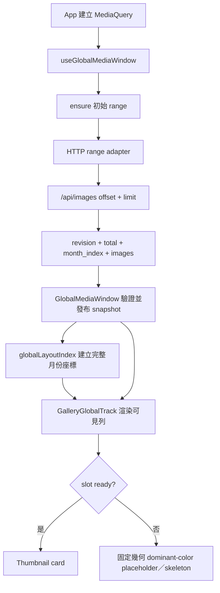
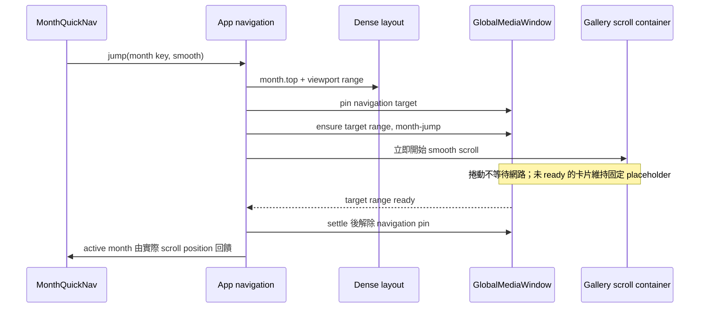
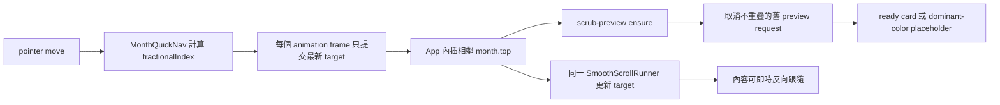

# 全域 Gallery 載入與月份導覽契約

狀態：現行實作契約

適用範圍：`GlobalMediaWindow`、全域 Gallery 虛擬軌道、月份版面索引、`MonthQuickNav`、跨 chunk 月份跳轉、拖曳 scrub、Gallery／Reader 記憶體界限。

本文件描述必須維持的行為與驗收界線。實際數值以程式中的 constants 與 tests 為單一事實來源；本文件負責說明數值的用途、允許改動的條件，以及改動後必須證明的結果。

## 1. 修改流程

變更上述範圍時依序完成：

1. 用本文件的「不可破壞契約」標記受影響項目。完成條件：每個受影響項目都有對應的既有或新增測試。
2. 從程式的責任邊界修改，不在呼叫端複製 chunk、月份高度、active month 或 scroll interpolation 邏輯。完成條件：同一規則仍只有一個 owner。
3. 在 `frontend/` 執行 `..\.runtime\pnpm\pnpm.cmd test:gallery-contract`。完成條件：專用 gate 全部通過。
4. 執行完整 frontend tests、build 與文件檢查。完成條件：本文件第 8 節所有適用 gate 通過。
5. 涉及互動、幾何、容量或載入時序時完成實際瀏覽器驗收。完成條件：第 8 節的情境沒有待驗項目；若環境無法執行，交付時明列未驗情境。

## 2. 責任邊界

| Owner | 唯一責任 |
| --- | --- |
| `backend/routes/gallery.py`、`backend/db.py` | 提供含 `revision`、`total`、range 與完整 `month_index` 的隨機存取契約 |
| `frontend/src/media-window/GlobalMediaWindow.ts` | chunk 對齊、請求去重／取消、revision 隔離、intent 優先序、pin 與 bounded LRU |
| `frontend/src/media-window/globalLayoutIndex.ts` | 連續月份座標、viewport range、Gallery card 幾何與 Webtoon dense height index |
| `frontend/src/components/GalleryGlobalTrack.tsx` | 只渲染可見月份／列；ready card 與 placeholder 使用相同幾何 |
| `frontend/src/utils/smoothScroll.ts` | 單一 latest-target rAF follower；只負責插值，不擁有 navigation transaction 或資料載入 |
| `frontend/src/components/MonthQuickNav.tsx` | pointer／keyboard gesture、每 frame 合併 pointer move、fractional month target |
| `frontend/src/components/GalleryGrid.tsx` | 由 dense layout 與實際 `scrollTop` 算出 authoritative active month |
| `frontend/src/App.tsx` | 組合 query、range pin／ensure、navigation phase、click smooth 與 scrub runner |

呼叫端以 `globalIndex` 與半開區間 `[start, end)` 溝通。HTTP page、cache map、request id 與 AbortController 留在 media-window implementation 內。

## 3. 首次載入資料流



不可破壞契約：

- 正常路徑只使用 range-first global media window；legacy pagination 只由明確 opt-in 環境變數啟用。
- `revision` 尚未建立前不把資料視為可合併的 global snapshot；query generation 改變後，舊回應不可發布到新 snapshot。
- 完整月份索引可常駐，但完整 `ImageItem` 必須稀疏載入；不得把結果全集載入記憶體或 DOM。
- 未載入卡片先用已保留的 `dominant_color`，缺色才使用中性 skeleton；替換為 ready card 時不得改變 row／month 高度或 `scrollTop`。
- Gallery range hydration 必須在回傳卡片前以便宜的 existence check 標記缺檔，即使該舊資料列尚未有 `viewer_media_metadata`；已知缺檔不得交給瀏覽器以縮圖 404 和重試來判定。

## 4. 月份點擊與跨 chunk 跳轉



不可破壞契約：

- layout index 已知目的座標時，scroll 必須立即開始，不等待 `ensure()` 完成。
- 一次點擊只有一條 scroll trajectory；資料完成不得啟動第二段校正動畫、反向跳動或重建另一套 page 座標。
- `month-jump` 可以 preempt 較低優先序請求；navigation target 在 settle 前保持 pinned。
- `prefers-reduced-motion` 使用立即定位；一般模式使用 motion-aware smooth behavior。

## 5. 按住拖曳 scrub



不可破壞契約：

- 第一次有效拖動立即處理，之後 pointer move 合併為每 animation frame 一次 latest-target update。
- 整個 gesture 共用一個 rAF runner；更新 target 不得建立並行動畫。反向拖曳必須由同一 runner 立即跟隨。
- `follow` 用於持續拖曳，`settle` 用於放開後收斂；兩者最後都必須到達精確 target。
- `scrub-preview` 只保留與最新目標重疊的 pending request；舊 preview 取消後，其 loading slots 回到 unloaded。
- 導覽期間 `GalleryGlobalTrack` 不以每個中間 scroll frame 重新追逐 viewport request；固定 placeholder 承接未載入內容。
- `navigationMode !== 'idle'` 時，ready card 也只顯示 `dominant_color`／skeleton，不得建立 `` 或取得 thumbnail scheduler admission；停穩回到 idle 後才載入當下可見縮圖。
- reduced motion 直接定位，不排入 animation frame。

## 6. QuickMonthNav 藍色指標

- Global Gallery 的 active month 由 `GalleryGrid` 使用 dense layout 與 gallery scroll container 的 activation line 計算，再透過 controlled `activeMonthKey` 傳給 `MonthQuickNav`。
- 虛擬化模式不得以「目前掛載的 DOM sections」推斷 active month；遠距月份可能尚未掛載。
- 點擊或 scrub 到固定月份後，藍色 active indicator 必須對應實際位於 activation line 的月份。hover／preview 可以另有狀態，但不可覆寫 authoritative active month。

## 7. 幾何與容量界限

### 7.1 月份與卡片幾何

月份高度的現行公式由 `globalLayoutIndex.ts` 實作：

```text
contentHeight = rows * cardSize + (rows - 1) * rowGap
monthHeight = headerHeight + contentGap + contentHeight
```

無卡片月份不加入 `contentGap`。`GalleryGlobalTrack` 必須使用同一份 `metrics.contentGap` 設定 grid shell 的 `margin-block-start` 與可用高度。固定高度 section 保留 `overflow: hidden` 時，最後一列底部必須仍落在 section bounds 內，卡片四角完整可見。

### 7.2 記憶體與工作量上限

目前 production constants 位於 `frontend/src/App.tsx`，圖片 admission constants 位於 `frontend/src/utils/imageLoadScheduler.ts`：

| 資源 | 現行界限 | 契約 |
| --- | ---: | --- |
| Media chunk | 64 items | range 先對齊固定 chunk |
| Completed unpinned chunks | 8 chunks | bounded LRU；基準完整媒體資料上限為 512 items |
| Reader range | 160 items | single／spread／webtoon 共用 bounded reader window |
| Active thumbnail admissions | 12 | scheduler 統一控制，不由元件自行繞過 |
| Active original admissions | 2 | scheduler 統一控制 |
| Completed media URL records | 384 | scheduler 淘汰較舊 URL record |

這不是固定 MB 上限：單一 `ImageItem`、瀏覽器 decoded bitmap、影片與 pinned ranges 的大小可變。8 chunks 是 completed **unpinned** LRU 基準；active Gallery viewport、reader 或 month navigation pins 可以暫時使 resident chunks 超過 8，解除 pin 後必須重新收斂。`placeholderColors` 是每 index 的輕量字串，可隨曾載入位置增加，但不得保留被淘汰 chunk 的完整 `ImageItem`。

調高任何界限前，提交者必須同時提供：對應自動化測試、cold-tab browser memory／DOM 證據，以及仍能在導航結束後收斂的證明。完成這三項才算符合契約。

## 8. 通過條件

### 8.1 必跑自動化 gate

在 `frontend/` 執行：

```powershell
..\.runtime\pnpm\pnpm.cmd test:gallery-contract
..\.runtime\pnpm\pnpm.cmd test
..\.runtime\pnpm\pnpm.cmd build
```

在 repository root 執行：

```powershell
git diff --check
```

若修改 backend range response、query、revision 或 month index，再執行：

```powershell
.\.runtime\backend-venv\Scripts\python.exe -m unittest backend.tests.test_gallery_routes backend.tests.test_main_http_routes -v
```

全部命令 exit code 為 0 才通過。`test:gallery-contract` 是此契約的最小防回退 gate；新增契約行為時，先把對應 test file 加入該 script。

### 8.2 必驗瀏覽器情境

涉及對應行為時，以 cold backend／fresh tab 驗證：

1. 首次載入：只出現 global range request；placeholder 到 ready card 不改變幾何與 scroll position。
2. 遠距點擊：跨至少兩個 chunk，按下後立即開始單向 smooth scroll，range 載入不造成第二段動畫。
3. 按住拖曳：連續跨多個月份後反向拖回；內容持續跟手，沒有停頓、空白重排或舊目標回彈。
4. 固定月份：settle 後藍色 indicator、月份 header 與 activation line 指向同一月份。
5. 卡片圓角：首列、中間列與最後一列的四角完整，月份底部沒有裁掉 `contentGap` 或 card radius。
6. 容量：長距離往返後 resident unpinned chunks 回到 production `maxChunks`，Gallery DOM 仍只涵蓋可見列與 overscan。
7. 動作偏好：`prefers-reduced-motion: reduce` 立即定位；`no-preference` 保留 smooth／follow 行為。
8. 診斷：Console 無新增 error；取消 stale scrub request 不留下永久 loading slot。
9. 冷啟動快速連點：導覽期間沒有 thumbnail ``，停穩後只載入最終可見列；缺檔顯示媒體狀態，不出現「縮圖載入失敗」。

## 9. 變更審查清單

- [ ] `globalIndex` 與 `[start, end)` 語意未被 page-local index 取代。
- [ ] scroll 開始不依賴 target range ready。
- [ ] click 與 scrub 各只有一個 scroll owner。
- [ ] placeholder、ready card 與 dense layout 使用相同幾何。
- [ ] `contentGap` 同時進入 month height、viewport math 與 grid shell spacing。
- [ ] active month 來自實際 scroll position，而非 navigation intent 或 mounted DOM window。
- [ ] pins 有明確 release；LRU 在 release 後可收斂。
- [ ] 新的 preview request 可以淘汰／取消舊 speculative work。
- [ ] navigation non-idle 期間沒有 thumbnail admission；缺檔在 Gallery response 階段已分類。
- [ ] 專用 gate、完整 suite、build 與適用 browser gates 都有結果。
